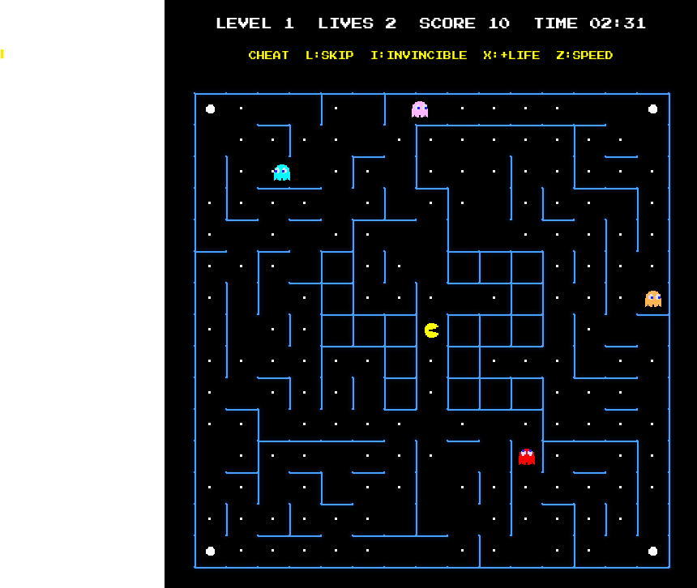
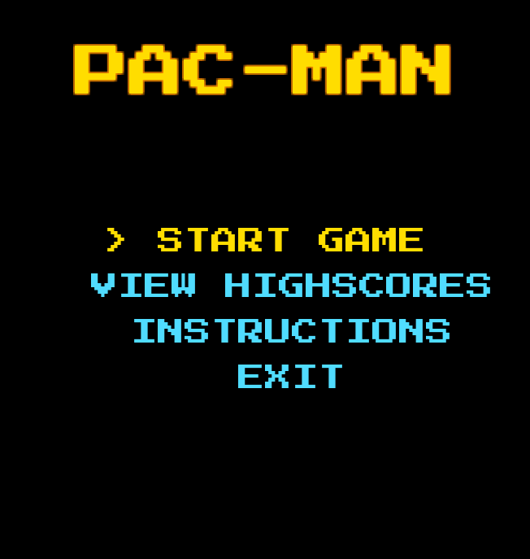

*This project has been created as part of the 42 curriculum by nocrespo & ayanez-o.*

# Pac-Man

## Description

A recreation of the classic arcade game **Pac-Man**, written in Python 3.10+
with object-oriented programming and a modular architecture.

The player guides Pac-Man through a maze, eats every pacgum, avoids four
ghosts and can turn the tables by eating super-pacgums. The game has at
least 10 levels, a time limit per level, a persistent top-10 highscore
system, a pause menu and a cheat mode for peer review.

Main features:

- Mazes generated by an external **A-maze-ing** package (not written by us).
- Game parameters loaded from a JSON file that supports comments.
- Robust error handling: invalid input never produces a Python traceback.
- Four ghosts with variable chase behaviors, a frightened mode and an
  eaten mode.
- Main menu, in-game HUD, pause menu, game over and victory screens.
- Persistent highscores stored in a JSON file.
- Cheat mode to help testing all the features quickly.

  

  

## Instructions

### Requirements

- Python 3.10 or later.
- The dependencies listed in `requirements.txt` (pygame, pydantic and the
  assigned maze generator package).

### Installation

```bash
make install
```

### Execution

The program takes **the first** argument: a JSON configuration file. Other arguments will be ignored.

```bash
python3 pac-man.py config.json
```

or simply:

```bash
make run
```

### Makefile rules

| Rule          | Description                                              |
|---------------|----------------------------------------------------------|
| `install`     | Installs the project dependencies.                       |
| `run`         | Runs the game with the default configuration file.       |
| `debug`       | Runs the game with Python's debugger (`pdb`).            |
| `clean`       | Removes `__pycache__`, `.mypy_cache` and other caches.   |
| `fclean`      | Removes also the virtual env.                            |
| `lint`        | Runs `flake8 .` and `mypy` with the flags of the subject.|
| `lint-strict` | Runs `flake8 .` and `mypy . --strict`.                   |

### Controls

| Key                     | Action                                        |
|-------------------------|-----------------------------------------------|
| Arrow keys or `WASD`    | Move Pac-Man                                  |
| `ESC`                   | Pause the game                                |
| `UP` / `DOWN` + `ENTER` | Navigate and select in the menus              |
| `ENTER` / `ESC`         | Go back from highscores and instructions      |
| `C`                     | Toggle the cheat mode                         |

Pac-Man keeps moving on its own until it hits a wall. The direction pressed
last is stored and applied as soon as the maze allows the turn.

### Rules

- Eat all the pacgums and super-pacgums to complete a level.
- Touching a ghost costs one life. Pac-Man respawns in the middle of the
  maze. The game is over when all lives are lost.
- Eating a super-pacgum makes the ghosts edible for a few seconds.
- Score and remaining lives are kept between levels.
- If the level timer reaches zero, the player loses a life and the timer
  restarts.
- The game is won when all the levels are completed.

### Cheat mode

Press `C` during the game to show or hide the cheat mode. While it is
active, the following keys are available (a legend is shown on screen):

| Key | Effect                                            |
|-----|---------------------------------------------------|
| `L` | Skip the current level                            |
| `I` | Toggle invincibility (ghosts cannot kill Pac-Man) |
| `X` | Add an extra life                                 |
| `Z` | Toggle double speed                               |

## Configuration

The configuration file is a JSON file. On top of standard JSON, **lines
starting with `#` are comments** and are ignored.

```json
# Example configuration
{
    "highscore_filename": "scores.json",
    "seed": 42,
    "lives": 3,
    "pacgums": 42,
    "points_per_pacgum": 10,
    "points_per_super_pacgum": 50,
    "points_per_ghost": 200,
    "level_max_time": 90,
    "level_nb": 10,
    "levels": [
        {"width": 15, "height": 15},
        {"width": 16, "height": 16}
    ]
}
```

### Keys and default values

| Key                       | Type    | Default       | Valid range | Description                                   |
|---------------------------|---------|---------------|-------------|-----------------------------------------------|
| `highscore_filename`      | string  | `scores.json` | non-empty   | File where the highscores are stored.         |
| `seed`                    | integer | `42`          | 1 - 1000    | Seed of the maze of the first level.          |
| `lives`                   | integer | `3`           | 1 - 100     | Lives at the start of the game.               |
| `pacgums`                 | integer | `100`         | 1 - 500     | Number of pacgums placed in each maze.        |
| `points_per_pacgum`       | integer | `10`          | 1 - 500     | Points for eating a pacgum.                   |
| `points_per_super_pacgum` | integer | `50`          | 1 - 500     | Points for eating a super-pacgum.             |
| `points_per_ghost`        | integer | `200`         | 1 - 500     | Points for eating an edible ghost.            |
| `level_max_time`          | integer | `90`          | 1 - 10000   | Time limit of each level, in seconds.         |
| `level_nb`                | integer | `10`          | 10 - 20     | Number of levels of the game.                 |
| `levels`                  | list    | auto-filled   | see below   | Size of the maze of each level.               |

Each element of `levels` is an object with:

| Key      | Default | Valid range |
|----------|---------|-------------|
| `width`  | `15`    | 15 - 25     |
| `height` | `15`    | 15 - 20     |

If fewer than `level_nb` levels are given, the missing ones are generated
automatically: each one is a cell wider and taller than the previous one,
up to a maximum of 25 x 20.

### Invalid configuration

- **Unknown keys** are ignored.
- **Missing or invalid values** are replaced by their default value, a
  clear warning is logged and the game continues.
- **Invalid levels** inside the `levels` list are discarded with a warning.
- **Level entries** (`width`/`height`) that are out of their valid range
  are clamped to the nearest valid value, with a warning; an element of
  `levels` that is not a JSON object (for example a number or a string) is
  discarded entirely.
- **Fatal problems** (file does not exist, is not a `.json` file, cannot
  be read, invalid JSON syntax, duplicate keys or a wrong number of
  arguments) print a clear message on the standard error and exit with a
  non-zero status, never with a traceback.

## Highscore

The highscore system is persistent and stored in a JSON file (its name is
set by `highscore_filename`). The file contains a list of entries:

```json
[
    {"name": "Alice", "score": 1500},
    {"name": "Bob", "score": 900}
]
```

How it works:

- Highscores are read when the highscore screen is opened and when a score
  is saved, and written back when the player enters their name at the end
  of a game (win or lose).
- Only the **top 10** scores are kept, sorted from highest to lowest.
- A valid entry has a name of **1 to 10 characters** (ASCII letters, digits
  and spaces only, not only spaces) and a **non-negative integer** score.
- The file is validated on reading. If it is missing, unreadable or has an
  invalid format, an error message is printed and the game continues with
  an empty list. Invalid entries are discarded and the valid ones are kept.
- The highscore screen is available from the main menu.

**Why this design:** a plain JSON file is human-readable, needs no extra
dependency and is easy to reset or inspect during a peer review. Validating
every entry on reading means a corrupted or hand-edited file can never
crash the game.

## Maze Generation

Mazes are generated with the **A-Maze-ing** package assigned to us by
another group. The package is used **as-is**, without modifying it, and our
loader (`src/maze_loader.py`) adapts to its interface.

- The maze is created with `MazeGenerator(size=(width, height),
  perfect=False, seed=seed)`. Using `perfect=False` produces loops in the
  maze, which gives Pac-Man-compatible corridors.
- **First level:** generated with the seed given in the configuration
  (`42` by default), so it is always the same.
- **Following levels:** generated with `seed=0`. In the assigned
  A-Maze-ing package, `seed=0` is interpreted as "no seed": the generator
  picks a new random seed internally on every call, so from level 2
  onwards each level gets a freshly generated, different maze every time
  the game is played.
- The generator returns a grid of integers. Each number encodes the walls
  of a cell with one bit per side: `1` north, `2` east, `4` south and
  `8` west. A bit set to 1 means that there is a wall on that side.
- Any failure of the generator is caught and reported with a clear message
  (`MazeLoadError`) instead of a traceback.

## Implementation

### Game states

The game is a state machine (`GameState`): main menu, playing, paused,
game over, victory, highscores and instructions. Each frame, the main loop
in `Game.run()` handles the events, updates and draws according to the
current state, and limits the speed to 60 FPS. The time between frames
(`dt`) is measured and capped so that movement does not depend on the
frame rate.

### Maze and coordinates

The maze is a grid of cells. A second grid (`screen_grid`) stores the
on-screen coordinates of the center of every cell. Sprites keep both their
pixel position and their current cell in the grid, and they can only move
towards a side of the cell if the corresponding wall bit is not set.

### Pac-Man

- The requested direction is stored and applied as soon as the maze allows
  the turn (arcade style). Small offsets are tolerated so that turning
  in corners feels natural.
- Pac-Man keeps moving until he hits a wall.
- Collisions use a collision box smaller than the image.
- When touched by a ghost, the death animation plays and then Pac-Man
  respawns in the middle of the maze.

### Ghosts

There are four ghosts (types 0 to 3), placed next to the four corners of
the maze. Each type alternates between wandering randomly and chasing
Pac-Man with different durations, so each one behaves differently.

- **Normal:** the ghost moves randomly for a while, then chases Pac-Man
  using a **BFS** (Breadth First Search) shortest path over the maze grid.
- **Frightened:** after a super-pacgum, ghosts turn blue and choose a
  destination far away from Pac-Man, using the same BFS. The animation
  flashes before the effect ends (8 seconds in total).
- **Eaten:** an eaten ghost turns into a pair of eyes and returns to its
  starting cell, where it comes back to normal.
- Ghosts avoid, as targets, the cells of the "42" pattern drawn in the
  center of the maze.

### Pacgums and super-pacgums

Pacgums are placed in random cells of the maze (the amount is set by
`pacgums`). Four super-pacgums are placed in the four corners.

### Custom sprite framework

Since the project must only rely on functionality that has an equivalent in
the MLX library, the project does not use `pygame.sprite` or `pygame.Rect`.
It has its own implementation of `Rect`, `CustomSprite`, `MovingSprite`
and `SpriteGroup`, and its own image scaling function.

### Error handling

- The entry point catches configuration, maze and resource errors and
  prints a one-line message.
- Files are always opened with context managers.

### Code quality

The code follows `flake8`, has type hints checked with `mypy`, and
docstrings in the NumPy style (PEP 257).

## General Software Architecture

```
pac-man.py                   Entry point: reads the argument, loads the
                             configuration and runs the game.
src/  
  parser.py                  Configuration loading and validation (pydantic).
  states.py                  GameState enumeration.
  maze_loader.py             Adapter to the A-Maze-ing package.
  screens.py                 Menus, input screens, info screens, highscores.
  game.py                    Game class: main loop, levels, HUD, cheat mode.
sprites/
  general_sprite_classes.py  Rect, CustomSprite, MovingSprite, SpriteGroup.
  pacman_sprite.py           PacMan
  ghosts.py                  Ghost
  pellets.py                 Pellet, MegaPellet
  sprite_groups.py           GhostGroup, PelletGroup, MegaPelletGroup and the
                             functions that create the sprites of a level.
src_images/                 
  pacman_and_ghosts_v2       Sprite sheet.

project_management/
  pacman_gantt.xlsx           Project timeline (Gantt chart).
  pacman_risk_analysis.docx    Risk analysis.
  analysis_and_decisions.docx Project analysis and technical decisions.
```

Relationships between the main classes:

- `Game` owns the screens, the sprite groups, the configuration and the
  current maze.
- `Game` uses `build_level_maze` (`maze_loader.py`) to obtain the grid of a
  level from the external package.
- `CustomSprite` is the abstract base class. `MovingSprite` extends it with
  grid movement, and `PacMan` and `Ghost` extend `MovingSprite`.
  `Pellet` and `MegaPellet` extend `CustomSprite`.
- `SpriteGroup` stores sprites and calls their methods in one go.
  `GhostGroup`, `PelletGroup` and `MegaPelletGroup` extend it with the
  behaviors of each kind of sprite (collisions, frightened mode...).
- `UserInterface` is the abstract base class of all the screens
  (`OptionsMenu`, `InputScreen` and `InfoScreen` and their subclasses).
- `GameConfiguration` and `LevelConfig` (pydantic models) validate the
  configuration.

